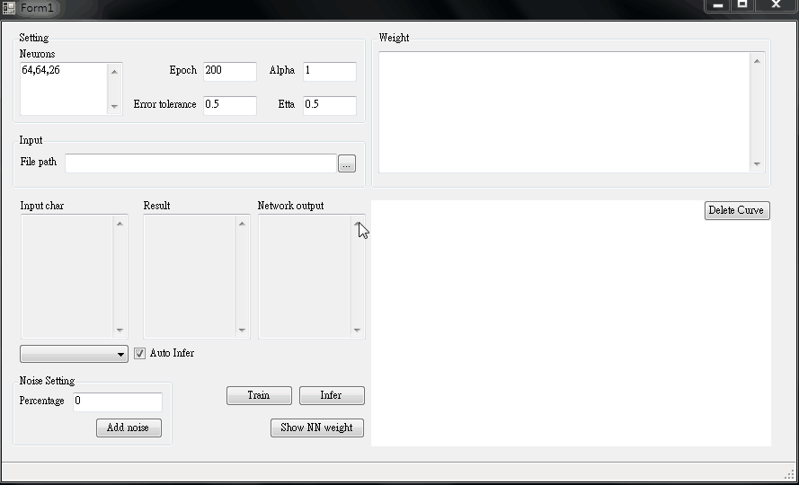
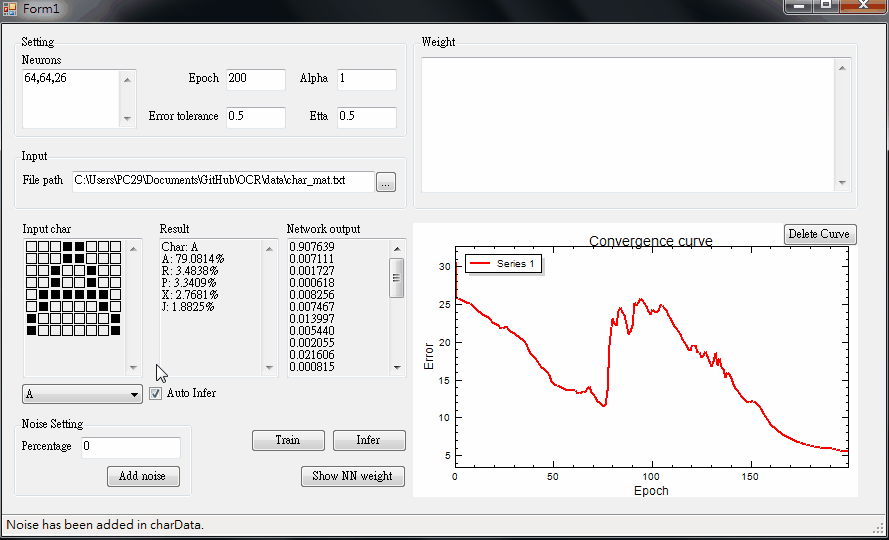

# OCR
A simple demo of OCR using C-sharp.

## Usage
* Trainning
    1. Import data from `data\char_mat.txt`

    2. Set parameters for trainning

    3. Click `train` button to start trainning

    

* Do inference with noisy inputs
    1. Set percentage of noise to be added

    2. Click `Add noise` button

    3. Select a input character to be infered

    
